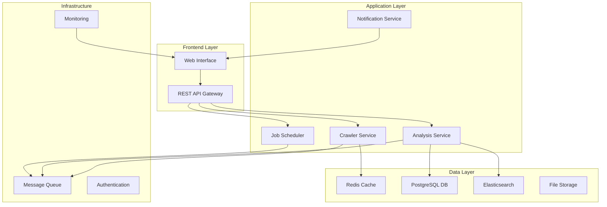

# Design Document

## Overview

The Enterprise Web Crawler is a scalable, multi-platform system designed to analyze marketing websites for broken links, accessibility compliance, and content quality. The system follows a microservices architecture with real-time capabilities, supporting deployment across Mac, Windows, Docker, and AWS environments.

### Key Design Principles

- **Scalability**: Handle 75,000+ links across 150 countries
- **Real-time Processing**: Immediate feedback and live updates
- **Cross-platform Compatibility**: Consistent behavior across all target platforms
- **Extensibility**: Modular design for future enhancements
- **Performance**: Sub-5-second response times for web interface interactions

## Architecture

### High-Level Architecture



### Technology Stack

**Backend Services:**
- **Node.js with TypeScript**: Primary runtime for services
- **Express.js**: Web framework for API gateway
- **Puppeteer**: Headless browser automation for crawling
- **Axe-core**: Accessibility testing engine for WCAG 2.2 AA compliance
- **Bull Queue**: Redis-based job queue for task management

**Data Storage:**
- **PostgreSQL**: Primary database for structured data
- **Redis**: Caching and session management
- **Elasticsearch**: Full-text search and indexing
- **AWS S3/Local Storage**: File storage for reports and assets

**Frontend:**
- **React with TypeScript**: Modern web interface
- **Socket.io**: Real-time communication
- **Material-UI**: Component library for consistent UX
- **Chart.js**: Data visualization for dashboards

**Infrastructure:**
- **Docker**: Containerization for consistent deployment
- **Docker Compose**: Local development orchestration
- **AWS ECS/EKS**: Cloud container orchestration
- **NGINX**: Reverse proxy and load balancing

## Components and Interfaces

### 1. Web Interface Component

**Purpose**: Provide user-friendly interface for crawler management and results visualization

**Key Features:**
- URL input with validation and exclusion path configuration
- Real-time progress monitoring with WebSocket connections
- Interactive dashboard with filtering and search capabilities
- Export functionality (PDF, CSV) for reports
- Pause/resume controls for crawl sessions

**Interfaces:**
- REST API calls to backend services
- WebSocket connection for real-time updates
- File download endpoints for report exports

### 2. Crawler Service

**Purpose**: Core crawling engine responsible for website analysis

**Key Features:**
- Multi-threaded crawling with configurable concurrency
- Robots.txt compliance and rate limiting
- Link discovery and validation
- Image asset verification
- Content change detection via MD5 hashing

**Interfaces:**
```typescript
interface CrawlerService {
  startCrawl(config: CrawlConfig): Promise<CrawlSession>
  pauseCrawl(sessionId: string): Promise<void>
  resumeCrawl(sessionId: string): Promise<void>
  getCrawlStatus(sessionId: string): Promise<CrawlStatus>
}

interface CrawlConfig {
  urls: string[]
  excludePaths: string[]
  maxDepth: number
  concurrency: number
  respectRobots: boolean
}
```

### 3. Analysis Service

**Purpose**: Analyze crawled content for accessibility and quality issues

**Key Features:**
- WCAG 2.2 AA compliance checking using Axe-core
- Broken link detection and categorization
- Image accessibility analysis
- Performance metrics collection
- Content quality scoring

**Interfaces:**
```typescript
interface AnalysisService {
  analyzeAccessibility(url: string, html: string): Promise<AccessibilityReport>
  validateLinks(links: Link[]): Promise<LinkValidationResult[]>
  generateComplianceScore(results: AccessibilityReport[]): Promise<ComplianceScore>
}

interface AccessibilityReport {
  url: string
  violations: WCAGViolation[]
  passes: WCAGPass[]
  incomplete: WCAGIncomplete[]
  score: number
}
```

### 4. Job Scheduler

**Purpose**: Manage crawl jobs, queuing, and resource allocation

**Key Features:**
- Priority-based job queuing
- Resource allocation and load balancing
- Retry logic for failed operations
- Progress tracking and reporting

**Interfaces:**
```typescript
interface JobScheduler {
  scheduleJob(job: CrawlJob): Promise<string>
  getJobStatus(jobId: string): Promise<JobStatus>
  cancelJob(jobId: string): Promise<void>
  retryFailedJobs(sessionId: string): Promise<void>
}
```

## Data Models

### Core Entities

```typescript
interface CrawlSession {
  id: string
  userId: string
  name: string
  status: 'pending' | 'running' | 'paused' | 'completed' | 'failed'
  config: CrawlConfig
  startTime: Date
  endTime?: Date
  progress: {
    totalUrls: number
    processedUrls: number
    failedUrls: number
  }
  createdAt: Date
  updatedAt: Date
}

interface CrawlResult {
  id: string
  sessionId: string
  url: string
  status: 'success' | 'failed' | 'skipped'
  httpStatus: number
  responseTime: number
  contentHash: string
  lastModified: Date
  issues: Issue[]
  accessibilityScore: number
  createdAt: Date
}

interface Issue {
  id: string
  type: 'broken_link' | 'missing_image' | 'accessibility' | 'performance'
  severity: 'low' | 'medium' | 'high' | 'critical'
  description: string
  element?: string
  wcagGuideline?: string
  remediation?: string
}

interface Link {
  url: string
  sourceUrl: string
  text: string
  type: 'internal' | 'external'
  status: 'pending' | 'valid' | 'broken' | 'redirect'
  httpStatus?: number
  redirectUrl?: string
}
```

### Database Schema

**PostgreSQL Tables:**
- `crawl_sessions`: Session metadata and configuration
- `crawl_results`: Individual page crawl results
- `issues`: Detected issues with categorization
- `links`: Link inventory and validation status
- `users`: User management and authentication
- `reports`: Generated report metadata

**Elasticsearch Indices:**
- `crawl-results`: Searchable crawl results
- `issues`: Searchable issue database
- `content`: Full-text searchable page content

## Error Handling

### Error Categories

1. **Network Errors**: Timeouts, DNS failures, connection refused
2. **HTTP Errors**: 4xx and 5xx status codes
3. **Content Errors**: Malformed HTML, missing resources
4. **System Errors**: Database failures, queue overload
5. **Validation Errors**: Invalid URLs, configuration errors

### Error Handling Strategy

```typescript
interface ErrorHandler {
  handleNetworkError(error: NetworkError): Promise<RetryDecision>
  handleHttpError(error: HttpError): Promise<void>
  handleSystemError(error: SystemError): Promise<void>
  logError(error: Error, context: ErrorContext): Promise<void>
}

interface RetryDecision {
  shouldRetry: boolean
  retryAfter: number
  maxRetries: number
}
```

### Resilience Patterns

- **Circuit Breaker**: Prevent cascade failures for external services
- **Retry with Exponential Backoff**: Handle transient failures
- **Bulkhead**: Isolate critical resources
- **Timeout**: Prevent hanging operations
- **Graceful Degradation**: Continue operation with reduced functionality

## Testing Strategy

### Testing Pyramid

1. **Unit Tests (70%)**
   - Service logic testing
   - Data model validation
   - Utility function testing
   - Mock external dependencies

2. **Integration Tests (20%)**
   - API endpoint testing
   - Database integration
   - Queue system integration
   - External service integration

3. **End-to-End Tests (10%)**
   - Complete user workflows
   - Cross-browser compatibility
   - Performance benchmarks
   - Accessibility compliance validation

### Test Implementation

```typescript
// Example unit test structure
describe('CrawlerService', () => {
  describe('startCrawl', () => {
    it('should validate crawl configuration', async () => {
      // Test implementation
    })
    
    it('should respect robots.txt when enabled', async () => {
      // Test implementation
    })
    
    it('should handle rate limiting correctly', async () => {
      // Test implementation
    })
  })
})

// Example integration test
describe('API Integration', () => {
  it('should create crawl session and return valid response', async () => {
    // Test implementation
  })
})
```

### Performance Testing

- **Load Testing**: Simulate 75,000+ URL crawling scenarios
- **Stress Testing**: Test system limits and failure points
- **Spike Testing**: Handle sudden traffic increases
- **Volume Testing**: Large dataset processing capabilities

### Accessibility Testing

- **Automated Testing**: Axe-core integration for WCAG compliance
- **Manual Testing**: Screen reader compatibility
- **Keyboard Navigation**: Full keyboard accessibility
- **Color Contrast**: WCAG AA contrast requirements

## Deployment Architecture

### Local Development

```yaml
# docker-compose.yml structure
version: '3.8'
services:
  web:
    build: ./frontend
    ports: ["3000:3000"]
  
  api:
    build: ./backend
    ports: ["8000:8000"]
    depends_on: [postgres, redis, elasticsearch]
  
  crawler:
    build: ./crawler
    depends_on: [redis, postgres]
  
  postgres:
    image: postgres:15
    environment:
      POSTGRES_DB: webcrawler
  
  redis:
    image: redis:7-alpine
  
  elasticsearch:
    image: elasticsearch:8.8.0
```

### AWS Deployment

**Infrastructure Components:**
- **ECS/EKS**: Container orchestration
- **RDS PostgreSQL**: Managed database
- **ElastiCache Redis**: Managed caching
- **OpenSearch**: Managed Elasticsearch
- **S3**: File storage
- **CloudFront**: CDN for web interface
- **Application Load Balancer**: Traffic distribution
- **CloudWatch**: Monitoring and logging

**Scaling Strategy:**
- **Horizontal Scaling**: Auto-scaling groups for crawler workers
- **Vertical Scaling**: Resource allocation based on load
- **Database Scaling**: Read replicas for query performance
- **Cache Scaling**: Redis cluster for high availability

### Security Considerations

**Mandatory for AWS Deployment:**
- **Network Security**
  - VPC configuration for AWS deployment
  - Security groups and NACLs
  - Rate limiting and DDoS protection

**Optional Enhancements:**
1. **Authentication & Authorization**
   - JWT-based authentication
   - Role-based access control (RBAC)
   - API key management for external integrations

2. **Data Protection**
   - Encryption at rest and in transit
   - PII data handling compliance
   - Secure credential management

3. **Compliance**
   - GDPR compliance for EU operations
   - SOC 2 Type II compliance
   - Regular security audits and penetration testing